# CSS snippets for obsidian <!-- omit in toc -->

Personal collection of obsidian snippets. These are written with the dark variant of the [minimal theme](https://github.com/kepano/obsidian-minimal) in mind but most should work on both light and dark variants of the vanilla obsidian theme. Some might need modifications to be useful, some might be a bit too topical, but there might be something of use to you here. Feel free to browse!

> [!TIP]
> Snippets have badges for various features or requirements. 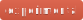 for being experimental,  for exposing [`cssclasses`](http://help.obsidian.md/snippets#Writing+CSS+for+Obsidian), 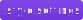 for providing [Obsidian Style Settings Plugin](https://github.com/mgmeyers/obsidian-style-settings) configuration options, and  for depending on a plugin or theme.

- [Installing](#installing)
- [Components](#components)
  - [Link callout / Card  ](#link-callout--card--)
    - [`cssclasses`](#cssclasses)
    - [Settings](#settings)
  - [`kbd` styling](#kbd-styling)
  - [Apple extended keyboard `kbd` styling](#apple-extended-keyboard-kbd-styling)
  - [Highlight styling  ](#highlight-styling--)
    - [Settings](#settings-1)
  - [Completed task opacity ](#completed-task-opacity-)
    - [Settings](#settings-2)
  - [Move completed tasks to bottom](#move-completed-tasks-to-bottom)
  - [`<ruby>` styling  ](#ruby-styling--)
- [Typography](#typography)
  - [`text-wrap` value for headings ](#text-wrap-value-for-headings-)
    - [Settings](#settings-3)
  - [`text-wrap` value for paragraphs ](#text-wrap-value-for-paragraphs-)
    - [Settings](#settings-4)
  - [`1lh` paragraph spacing](#1lh-paragraph-spacing)
  - [Monospace font feature settings ](#monospace-font-feature-settings-)
    - [Settings](#settings-5)
  - [Muted URL text in markdown source](#muted-url-text-in-markdown-source)
  - [Source Mode Editor Font ](#source-mode-editor-font-)
    - [Settings](#settings-6)
  - [Disable the default subpixel antialiasing (MacOS only)](#disable-the-default-subpixel-antialiasing-macos-only)
  - [italicized comments for code blocks ](#italicized-comments-for-code-blocks-)
  - [`text-box-trim` ](#text-box-trim-)
- [Images](#images)
  - [Force 16/4 image ratio ](#force-164-image-ratio-)
  - [Force 100% image width ](#force-100-image-width-)
  - [No image grid column gaps  ](#no-image-grid-column-gaps--)
  - [Auto image rendering](#auto-image-rendering)
  - [Pixelated image rendering ](#pixelated-image-rendering-)
- [Credits](#credits)

## Installing

You can find detailed CSS snippet installation instructions at Obsidian's [help page](https://help.obsidian.md/snippets#Adding+a+snippet)

## Components

### Link callout / Card  

[`callout-link.css`](callout-link.css)

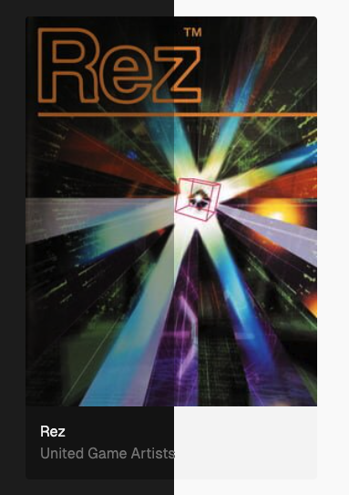

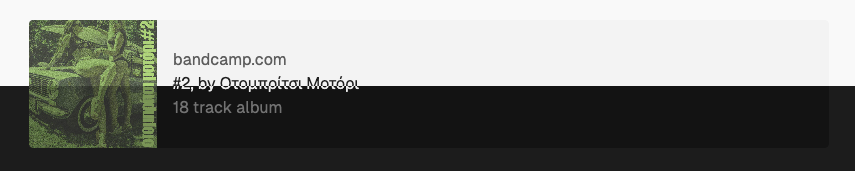

Styles an obsidian callout component as a vertical (`link`) or horizontal (`hlink`) card component using the existing callout syntax. Gracefully degrades if unstyled.

Here's how it works, best used in templates because of the finicky syntax. All parts are required:

```markdown
> [!link] ignored <!-- title ignored, hlink produces horizontal link callout rather than vertical/card callout -->
> [Example Title w/ link](https://example.com/xxx) <!-- title, can be just text but also link -->
>
> ![[S8288469ecf534a62b5462ae9ef47bf5dK.webp]] <!-- cover image, can also be in the standard markdown inline image link format -->
>
> [example.com](https://example.com/xxx) <!-- link, can be also be an empty link: []() -->
>
> A very nice description <!-- description, can be skipped by using a not-printable character like <wbr> -->
```

This is how the vertical link callout in the screenshot above is produced:

```yaml
# frontmatter, see cssclasses below
cssclasses:
  - callout-link-ratio-3-4
  - callout-link-max-w-20
```

```markdown
> [!link]
> Rez
>
> ![[Gamedb/_resources/Rez-co720j.jpg]]
>
> []()
>
> United Game Artists<wbr>
```

And this is how the horizontal link is produced:

```markdown
> [!hlink] #2, by Οτομπρίτσι Μοτόρι
> #2, by Οτομπρίτσι Μοτόρι
>
> 
>
> [bandcamp.com](https://otompritsisuperdeluxe.bandcamp.com/album/2)
>
> 18 track album
```

#### `cssclasses`

- `callout-link-image-contain` will use `object-fit: contain;` for cover images
- `callout-link-max-w-20` will set the max width for the default variant to `20rem`
- `callout-link-ratio-3-4` will set the cover image aspect ratio to 3/4.
  When combined with `callout-link-max-w-20` works well with tall and narrow cover images like movie posters

#### Settings

| id                                    | default                                                 |
| ------------------------------------- | ------------------------------------------------------- |
| `callout-link-max-width-default`      | 30rem                                                   |
| `callout-link-min-width`              | 20rem                                                   |
| `callout-link-max-height-horizontal`  | 8rem                                                    |
| `callout-link-background`             | `rgb(18 18 18)` (dark), `rgba(0, 0, 0, 0.024)` (light)  |
| `callout-link-link-color`             | `rgb(125 125 125)` (dark), `rgb(104, 104, 104)` (light) |
| `callout-link-link-hover-color`       | `rgb(145 145 145)` (dark), `rgb(84, 84, 84)` light      |
| `callout-link-title-color`            | `rgb(241 241 241)` (dark), `rgb(35, 35, 35)` light      |
| `callout-link-desc-color`             | `rgb(125 125 125)` (dark), `rgb(104, 104, 104)` light   |
| `callout-link-cover-image-background` | `rgb(0, 0, 0)` (dark), `rgb(255, 255, 255)` light       |

[🔼 Back to top](#css-snippets-for-obsidian-)

### `kbd` styling

[`kbd.css`](kbd.css)

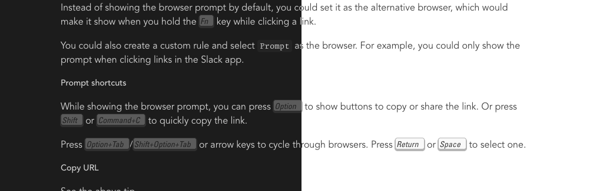

Styling for the `<kbd>` elements and hotkey display.

[🔼 Back to top](#css-snippets-for-obsidian-)

### Apple extended keyboard `kbd` styling

[`kbd-aek.css`](kbd-aek.css)

[kbd.css's](#kbd-styling) sibling, uses the Univers typeface in italic to match the style of the Apple extended keyboard keycap style. Falls back to `--font-text` if Univers is not available.

[🔼 Back to top](#css-snippets-for-obsidian-)

### Highlight styling  

[`highlight-experimental.css`](highlight-experimental.css)

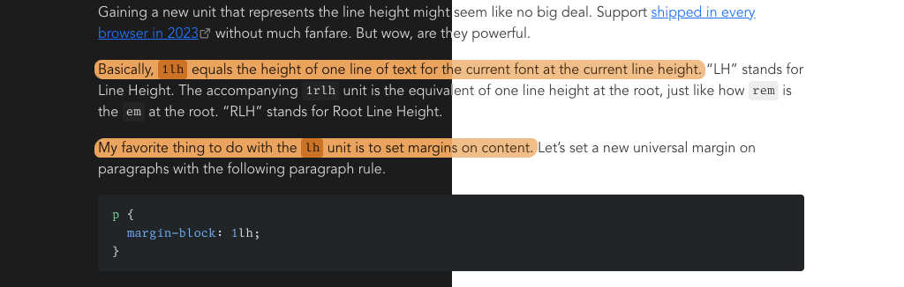

Custom highlight styling, uses pseudo-random border radii and [`box-decoration-break: clone`](https://developer.mozilla.org/en-US/docs/Web/CSS/Reference/Properties/box-decoration-break#clone).

#### Settings

| id                            | default                                                                     |
| ----------------------------- | --------------------------------------------------------------------------- |
| `highlight-background`        | `hsla(33.26, 80%, 65.69%, 1)` (dark), `hsla(33.26, 80%, 75.69%, 1)` (light) |
| `highlight-box-shadow-offset` | `2px`                                                                       |

[🔼 Back to top](#css-snippets-for-obsidian-)

### Completed task opacity 

[`completed-tasks.css`](completed-tasks.css)

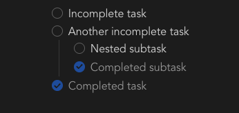

Used to dim completed tasks. Will dim all nested subtasks and bullet points.

#### Settings

| id                       | default |
| ------------------------ | ------- |
| `completed-task-opacity` | 0.7     |

[🔼 Back to top](#css-snippets-for-obsidian-)

### Move completed tasks to bottom

[`task-ordering.css`](task-ordering.css)

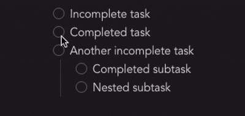

(Visually) moves completed tasks to the bottom of their list regardless of source order. Works only in reading view.

[🔼 Back to top](#css-snippets-for-obsidian-)

### `<ruby>` styling  

[`ruby-experimental.css`](ruby-experimental.css)

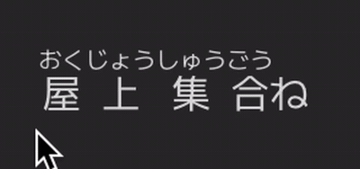

Styling for the `ruby` element. Depends on this [fork](https://github.com/akatopo/obsidian-markdown-furigana/) of [obsidian-markdown-furigana](https://github.com/steven-kraft/obsidian-markdown-furigana) for the hover effect.

## Typography

[🔼 Back to top](#css-snippets-for-obsidian-)

### `text-wrap` value for headings 

[`heading-text-wrap.css`](heading-text-wrap.css)

Text wrapping to use for headings in rendered markdown. Works only in reading view. Defaults to [`balance`](https://developer.mozilla.org/en-US/docs/Web/CSS/Reference/Properties/text-wrap#balance)

#### Settings

| id                                    | default   |
| ------------------------------------- | --------- |
| `rendered-markdown-heading-text-wrap` | `balance` |

[🔼 Back to top](#css-snippets-for-obsidian-)

### `text-wrap` value for paragraphs 

[`paragraph-text-wrap.css`](paragraph-text-wrap.css)

Text wrapping to use for paragraphs in rendered markdown. Works only in reading view. Defaults to [`pretty`](https://developer.mozilla.org/en-US/docs/Web/CSS/Reference/Properties/text-wrap#pretty)

#### Settings

| id                                      | default  |
| --------------------------------------- | -------- |
| `rendered-markdown-paragraph-text-wrap` | `pretty` |

[🔼 Back to top](#css-snippets-for-obsidian-)

### `1lh` paragraph spacing

[`paragraph-spacing.css`](paragraph-spacing.css)

[MDN](https://developer.mozilla.org/en-US/docs/Web/CSS/Reference/Values/length#lh)

[🔼 Back to top](#css-snippets-for-obsidian-)

### Monospace font feature settings 

[`monospace-font-feature-settings.css`](monospace-font-feature-settings.css)

Feature settings used for monospace fonts in places like code blocks and frontmatter. See [MDN](https://developer.mozilla.org/en-US/docs/Web/CSS/font-feature-settings) for syntax.

#### Settings

| id                                | default  |
| --------------------------------- | -------- |
| `monospace-font-feature-settings` | `"ss02"` |

[🔼 Back to top](#css-snippets-for-obsidian-)

### Muted URL text in markdown source

[`muted-url-in-editing-mode.css`](muted-url-in-editing-mode.css)

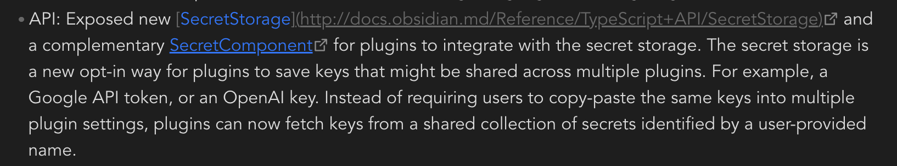

Uses [minimal theme](https://github.com/kepano/obsidian-minimal)'s [`--text-formatting`](https://github.com/kepano/obsidian-minimal/blob/3dc11f98fa0c8a1badf36ff5fcc85f5a4bc29682/src/scss/variables/theme.scss#L97) value and falls back to Obsidian's [`--text-faint`](https://docs.obsidian.md/Reference/CSS+variables/Foundations/Colors#Text+foreground+colors) value.

[🔼 Back to top](#css-snippets-for-obsidian-)

### Source Mode Editor Font 

[`source-mode-editor-font.css`](source-mode-editor-font.css)

Font to use exclusively for the source mode in the editing view.

#### Settings

| id                        | default                 |
| ------------------------- | ----------------------- |
| `source-mode-editor-font` | `var(--font-monospace)` |

[🔼 Back to top](#css-snippets-for-obsidian-)

### Disable the default subpixel antialiasing (MacOS only)

[`webkit-font-smoothing-antialiased.css`](webkit-font-smoothing-antialiased.css)

Makes fonts appear visually lighter by applying `-webkit-font-smoothing: antialiased` to the document body. More about this in this [blog post](https://dbushell.com/2024/11/05/webkit-font-smoothing/).

[🔼 Back to top](#css-snippets-for-obsidian-)

### italicized comments for code blocks 

[`italic-code-comments.css`](italic-code-comments.css)

Pretty specific hack for italicized code comments for the [shiki plugin](https://github.com/mProjectsCode/obsidian-shiki-plugin) using the github dark theme.

[🔼 Back to top](#css-snippets-for-obsidian-)

### `text-box-trim` 

[`text-box-trim-experimental.css`](text-box-trim-experimental.css)

Experimental use of [`text-box-trim`](https://developer.mozilla.org/en-US/docs/Web/CSS/Reference/Properties/text-box-trim), check [text-box-trim-examples](https://github.com/jantimon/text-box-trim-examples/tree/main) for examples. Not recommended for general use.

## Images

[🔼 Back to top](#css-snippets-for-obsidian-)

### Force 16/4 image ratio 

[`img-ratio-16-4.css`](img-ratio-16-4.css)

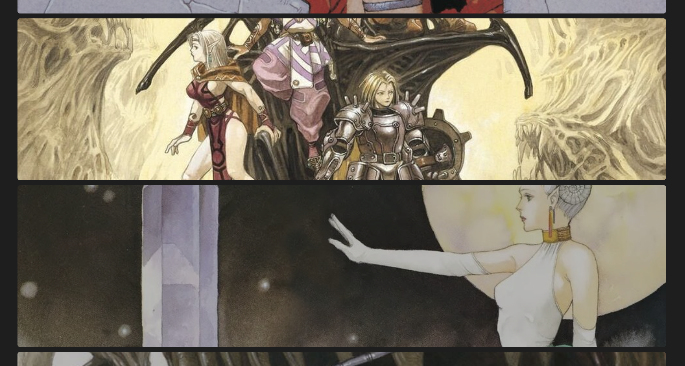

Forces an ultra-wide 16/4 ratio for all note images when adding `img-ratio-16-4` to `cssclasses`. Works only in reading view.

[🔼 Back to top](#css-snippets-for-obsidian-)

### Force 100% image width 

[`img-width-100.css`](img-width-100.css)

Forces a 100% width for all note images that have not a width defined already (ex. `![[img.png|256]]`) when adding `img-width-100` to `cssclasses`. Works only in reading view.

[🔼 Back to top](#css-snippets-for-obsidian-)

### No image grid column gaps  

[`img-grid-gap-0.css`](img-grid-gap-0.css)

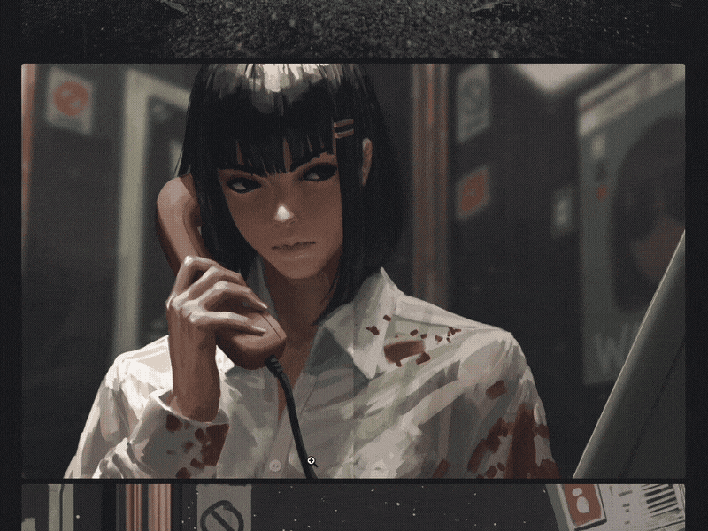

Eliminates column gaps in [minimal theme](https://github.com/kepano/obsidian-minimal) image grids. Useful for things like magazine spreads or continuous images.

Usable by adding `img-grid-gap-0` to the `cssclasses` frontmatter prop.

[🔼 Back to top](#css-snippets-for-obsidian-)

### Auto image rendering

[`image-rendering.css`](image-rendering.css)

Sets `image-rendering` to `auto` by default for both editing and reading views.

[🔼 Back to top](#css-snippets-for-obsidian-)

### Pixelated image rendering 

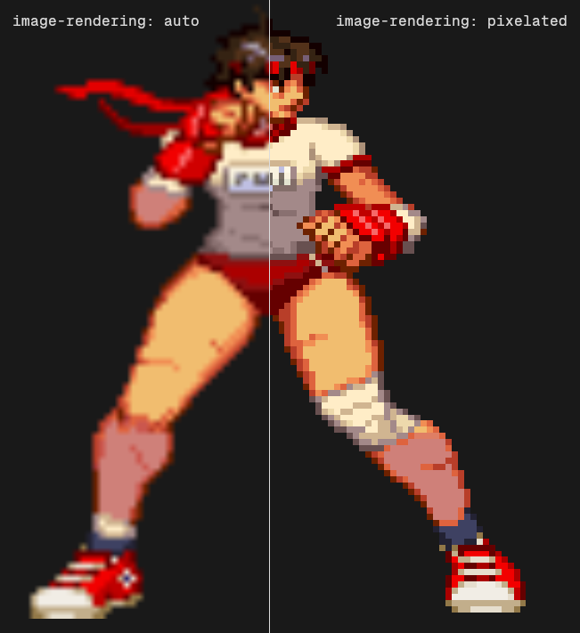

Sets `image-rendering` to `pixelated` for note images. Useful for scaled pixel art.

Usable by adding `img-rendering-pixelated` to the `cssclasses` frontmatter prop.

[🔼 Back to top](#css-snippets-for-obsidian-)

## Credits

- `kbd` element styling based on Dylan Smith's [Styling the kbd element](https://dylanatsmith.com/wrote/styling-the-kbd-element)
- Used Kacper Kula's [Randomness in CSS with trigonometry functions](https://hypersphere.blog/blog/randomness-in-css-using-trigonometry/) for producing randomness in CSS
- Badges generated with [shields.io](https://shields.io/badges)
